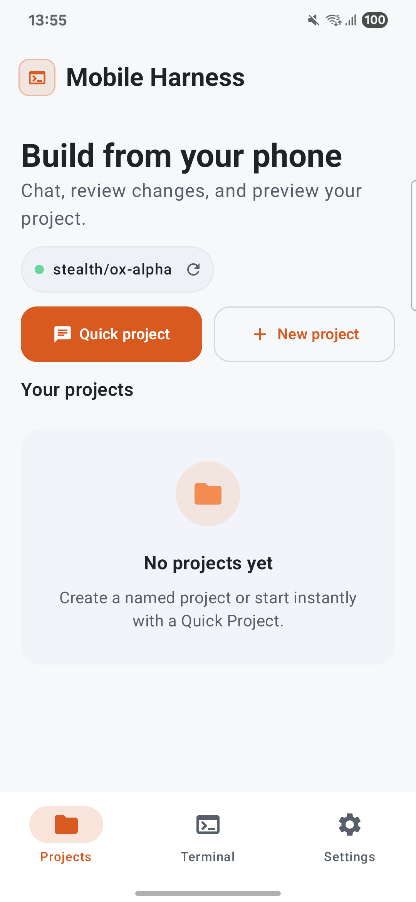
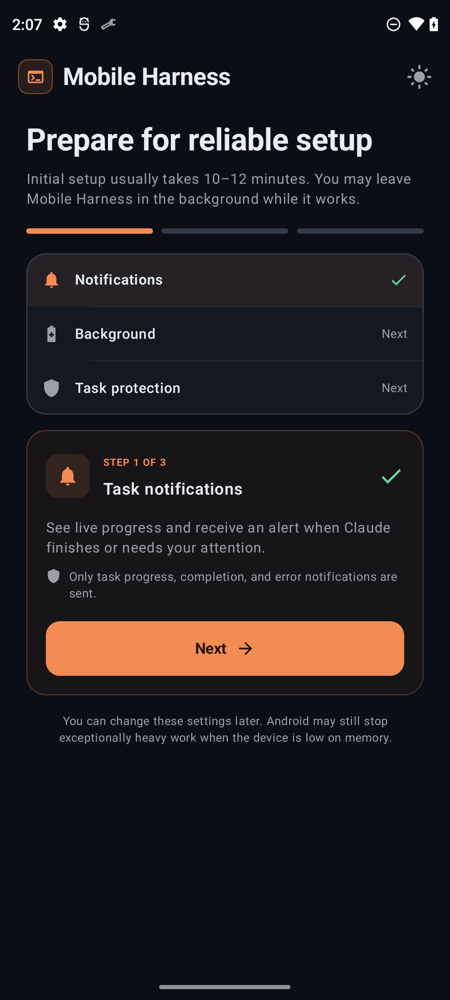

# Pocket IDE

  

<h3 align="center">A complete development environment for Android.</h3>

  Write code. Run Linux tools. Build projects. Review changes. Use AI when it helps.

  <a href="https://github.com/rahilanw4r/pocket-ide/releases">Releases</a> ·
  <a href="https://github.com/rahilanw4r/pocket-ide/issues">Issues</a> ·
  <a href="PRIVACY.md">Privacy</a>

  
  
  
  
  

Pocket IDE is a mobile-first Android development environment with an isolated Linux userspace, project workspaces, terminals, Git workflows, local previews, Android build support, and integrated AI coding agents.

It is designed around one idea: **your phone should be able to do real development work, not just edit a few lines of code.**

> **Current status:** Pocket IDE is experimental alpha software. Runtime compatibility, AI integrations, toolchains, and device behavior can change between releases.

---

## Screenshots

  
  

---

## What you can do

Pocket IDE brings a development workflow together in one Android app.

| Area | What it provides |
| --- | --- |
| Projects | Persistent projects, Quick Projects, imports and workspaces |
| Editor | Mobile-first code and file workflow |
| Terminal | Linux shell and development commands |
| Linux runtime | Private ARM64 userspace with common developer tools |
| Git | Repository workflows, changes and review |
| AI | Coding agents and provider-backed assistance |
| Preview | Local web-server preview inside the app |
| Android | Android project toolchain and local builds |
| Toolchains | Optional language and platform stacks |
| Background work | User-started setup and coding tasks with progress notifications |

The exact capabilities available to you depend on the Pocket IDE version, selected runtime components, project type, device, and configured AI provider.

---

## The Pocket IDE workflow

~~~text
Create / Open
      ↓
   Explore
      ↓
     Edit
      ↓
  Run / Test
      ↓
 Build / Debug
      ↓
 Review Changes
      ↓
   Commit / Push
      ↺
~~~

AI fits into the workflow instead of replacing it.

You can use an agent to understand a project, implement a change, investigate an error, write tests, refactor code, or review a result while keeping the project, terminal and files in the same workspace.

---

## Getting started

### 1. Install Pocket IDE

Download the latest release from GitHub:

**[Download the latest release](https://github.com/rahilanw4r/pocket-ide/releases/latest)**

Install the APK and launch Pocket IDE.

Pocket IDE currently supports **Android 9 / API 28 and newer on ARM64 devices**. Root access is not required.

### 2. Complete the first-run setup

On first launch, Pocket IDE prepares its Linux development environment.

Depending on what you select, setup may download:

- Linux runtime components
- Node.js and npm
- Python
- Android development tools
- Claude Code
- Antigravity CLI
- Other optional development components

Setup can take several minutes and may require significant storage. Keep the device connected to the internet and avoid force-stopping Pocket IDE while setup is running.

The setup screen shows progress and provides a way to stop the operation safely.

### 3. Configure notifications

Allow notifications when Android asks.

Pocket IDE uses notifications for user-started setup and long-running coding tasks. On Android 13 and newer, notification access is a runtime permission. If you deny it, Pocket IDE can still run, but you may not see task progress and completion notifications.

### 4. Configure battery usage

For reliable background coding tasks, set Pocket IDE's battery usage to **Unrestricted** if your device offers that option.

Typical path:

~~~text
Settings
→ Apps
→ Pocket IDE
→ Battery
→ Unrestricted
~~~

The exact path and wording vary by Android version and manufacturer.

This is **not an Android runtime permission**. It is a system battery-management setting. It is especially useful on devices that aggressively stop background applications.

You do not need to disable battery optimization simply to use the editor or terminal in the foreground.

### 5. Configure an AI provider

Open:

~~~text
Pocket IDE
→ Copilot / AI
→ AI Configuration
~~~

Choose an available provider or agent integration and complete its authentication or API-key setup.

Keep credentials inside Pocket IDE's protected configuration. Never commit API keys to a project or paste them into GitHub issues.

### 6. Create or open a project

From Projects, choose the workflow that fits your task:

- New Project
- Quick Project
- Import
- Git repository

Give the project a name and select the appropriate stack or template when available.

### 7. Start developing

A normal session looks like:

~~~text
Open project
→ Browse files
→ Edit code
→ Ask AI for help
→ Run commands
→ Test
→ Review changes
→ Commit with Git
~~~

For web projects, start the development server and use Pocket IDE's preview when supported.

---

## Permissions and Android settings

Pocket IDE intentionally keeps its permission surface narrow.

### Network access

Used for:

- downloading runtime components and toolchains
- communicating with configured AI providers
- accessing package repositories
- local development features that require networking

Pocket IDE does not require location access for its development workflow.

### Notifications

**Android 13+:** notification permission may be requested.

Notifications are used for:

- runtime setup progress
- long-running coding tasks
- task completion
- task failures requiring attention

Allowing notifications is recommended if you use background or long-running tasks.

### Foreground service

Pocket IDE uses Android foreground services for user-started operations that need to continue while you temporarily leave the app.

Examples:

- installing or repairing the Linux runtime
- running a long coding task

Android displays an ongoing notification while these operations are active, including a Stop action where supported.

### Battery / background activity

There is no separate Android permission called "Battery Unrestricted."

Instead, Android provides battery-management controls that can restrict background execution.

For the best reliability when running long coding tasks:

~~~text
Battery usage → Unrestricted
~~~

This setting is optional, but recommended on devices with aggressive background process management.

### Wake lock

Pocket IDE can use a short-lived partial wake lock while an active user-started task needs the CPU to remain available.

This is not a user-granted runtime permission. The lock is released when the task completes, fails, or is cancelled.

### Installing APKs

Pocket IDE declares Android's package-install capability because a project may produce an APK that you want to install.

If Android asks you to allow Pocket IDE to install unknown apps, that setting is controlled by Android and is only relevant to the APK-install workflow.

Pocket IDE cannot silently install an application; Android's installer remains in control.

### Files and folders

Pocket IDE uses Android's system document picker for user-selected files and folders.

You choose what the app can access instead of granting broad storage access.

### What Pocket IDE does not currently request

The current application manifest does not declare permissions for:

- Location
- Camera
- Microphone
- Contacts
- SMS
- Phone calls
- Broad external storage access

---

## Working with projects

### Create a project

Use a template when you want Pocket IDE to prepare the initial structure for you.

Then:

~~~text
Project
→ Files
→ Edit
→ Terminal
→ Run
~~~

### Import an existing project

Import a project directory or files using Android's system picker.

After import, verify:

1. the project root is correct
2. required dependencies are installed
3. the selected toolchain is available
4. the project builds successfully

### Git repositories

A typical Git workflow is:

~~~bash
git clone <repository>
cd <project>

git status
git checkout -b feature/my-change

# edit and test

git diff
git add .
git commit -m "Describe the change"
git push
~~~

Pocket IDE is intended to keep this workflow close to the code and terminal rather than forcing you to move between separate apps.

---

## Terminal

Pocket IDE includes a Linux terminal for development commands.

Examples:

~~~bash
pwd
ls
git status

npm install
npm run dev

python3 main.py

./gradlew assembleDebug
~~~

The exact commands available depend on the runtime and installed toolchains.

---

## Linux runtime

Pocket IDE uses an unprivileged Linux userspace based on **PRoot**.

The current runtime bundles are ARM64 and use Ubuntu as their base. Optional bundles can add language runtimes, Android tooling, coding agents, and other development utilities.

The runtime is isolated from Android's normal application environment, but **PRoot is not a hardened security sandbox**.

Treat the Linux environment as a development workspace, not as a security boundary for untrusted software.

Only run projects, scripts, binaries and dependencies you trust.

### Current runtime components

The repository's runtime manifest currently includes bundles for:

- Core Linux environment
- Node.js / npm
- Python
- Android development tools
- Claude Code
- Antigravity CLI

Versions and bundle contents can change independently of the Android application.

---

## AI development

AI is an integrated development capability in Pocket IDE.

Depending on the configured agent and provider, you can use AI to:

- understand a codebase
- explain files or errors
- create or modify code
- refactor existing code
- generate tests
- investigate build failures
- run development commands
- review changes
- continue work inside an existing project

The agent can work with project context when the selected task requires it.

### AI is optional

Pocket IDE remains useful without an AI provider.

You can still use:

~~~text
Projects
Files
Editor
Terminal
Git
Toolchains
Builds
Preview
~~~

AI adds another layer to the development workflow; it is not the entire product.

---

## AI data and privacy

Pocket IDE is local-first, but it is not accurate to say that every operation stays on the device.

Local project data, runtime files, conversations, attachments and diagnostics are stored in the app's private storage.

Provider credentials are protected using Android Keystore-backed encryption.

When you use an external AI provider, information needed for that request can leave the device. Depending on the task, this may include:

- prompts
- conversation context
- relevant source code
- file paths
- file contents
- terminal/tool output
- attachments

Runtime setup can also contact external software distribution services to download required components.

Read the complete policy:

**[PRIVACY.md](PRIVACY.md)**

---

## Supported development stacks

Pocket IDE is intended for real development rather than one specific language.

Current runtime support includes, depending on installed components:

| Stack | Typical use |
| --- | --- |
| JavaScript / TypeScript | Node.js, Vite, web applications |
| Python | Scripts, APIs and automation |
| Android | Java/Kotlin Android projects |
| C / C++ | Native programs and CMake projects |
| PHP | PHP and Composer projects |
| Shell | Bash scripts and Linux automation |

Support depends on the installed toolchain and project requirements.

---

## Web development and preview

For supported web projects:

~~~text
Start development server
        ↓
Pocket IDE detects the local service
        ↓
Open Preview
        ↓
Test the application
~~~

The preview environment is intended for local development and testing.

It is not a replacement for production hosting.

---

## Android development

Pocket IDE can install an Android-focused toolchain containing components such as:

- OpenJDK 17
- Android SDK
- Android Build Tools
- Gradle
- Offline Maven artifacts
- ARM64-compatible Android build components

Large Android toolchains require substantial storage.

A full Android setup is therefore optional rather than part of the smallest runtime installation.

Example:

~~~bash
./gradlew assembleDebug
~~~

The exact build command depends on the project.

---

## Storage and resource requirements

Minimum supported environment:

- Android 9 / API 28+
- ARM64 / arm64-v8a
- Root not required

Recommended:

- 3 GB RAM or more
- Several GB of free storage for development
- More storage for Android SDKs and optional runtimes
- Stable Wi-Fi for initial runtime setup

Actual requirements vary considerably.

A Node project and a large Android project do not have the same memory or storage profile.

---

## Installation methods

### APK release

The easiest method for most users:

1. Open [Releases](https://github.com/rahilanw4r/pocket-ide/releases).
2. Open the latest release.
3. Download the appropriate APK.
4. Install it.
5. Launch Pocket IDE.
6. Complete runtime setup.

If Android blocks the installation, check the system's **Install unknown apps** setting for the application you used to open the APK.

### Build from source

Requirements:

- Android SDK
- JDK 17
- Android NDK required by the project
- Git
- Git submodules
- Linux/macOS/Windows development environment capable of running Gradle

Clone the repository:

~~~bash
git clone https://github.com/rahilanw4r/pocket-ide.git
cd pocket-ide
git submodule update --init --recursive
~~~

Build an online debug APK:

~~~bash
./gradlew :app:assembleOnlineDebug
~~~

Install directly to a connected Android device:

~~~bash
./gradlew :app:installOnlineDebug
~~~

The repository also contains scripts and workflows for release builds.

Do not commit signing keys, passwords, API keys, or private credentials.

---

## Repository structure

~~~text
pocket-ide/
├── app/                       Android application
│   ├── src/main/              Kotlin, Compose and native runtime code
│   └── src/test/              Unit tests
├── assets/                    Project and README assets
├── docs/                      Development and Play documentation
├── dist/                      Runtime bundle metadata
├── fastlane/                  Store metadata and release assets
├── fdroid/                    F-Droid metadata
├── scripts/                   Build and runtime scripts
├── third_party/               Third-party components
├── PRIVACY.md                 Privacy policy
├── LICENSE                    MIT license
└── README.md                  Project documentation
~~~

---

## Architecture

At a high level:

~~~text
Android / Jetpack Compose
          │
          ├── Projects
          ├── Editor
          ├── Terminal
          ├── Git
          └── AI / Agents
                  │
                  ▼
          Runtime Services
                  │
                  ▼
          Native / JNI Layer
                  │
                  ▼
          PRoot Linux Userspace
                  │
        ┌─────────┼─────────┐
        ▼         ▼         ▼
      Shell     Tools     Toolchains
~~~

Pocket IDE combines Android UI, native components and a private Linux userspace rather than relying on a remote development server.

---

## Security model

Pocket IDE uses:

- Android app-private storage
- Android Keystore-backed credential protection
- HTTPS for supported external services
- Runtime bundle checksum verification
- Unprivileged Linux userspace
- Android's system installer for APK installation
- User-controlled AI provider configuration

Important limitation:

**PRoot is not a hardened sandbox.**

Do not use Pocket IDE as a security boundary for malicious or untrusted executables.

---

## Troubleshooting

### Runtime setup is stuck

Check:

1. Internet connectivity
2. Available storage
3. Whether Android has restricted Pocket IDE's background activity
4. Whether the notification/task is still active
5. Runtime setup logs shown by the app

If setup was interrupted, retry the setup so Pocket IDE can repair or resume the environment.

### Coding task stops when I leave the app

Check:

~~~text
Settings
→ Apps
→ Pocket IDE
→ Battery
→ Unrestricted
~~~

Also make sure notifications are enabled.

OEM background-management policies can be more aggressive than stock Android.

### Notifications are missing

On Android 13+:

~~~text
Settings
→ Apps
→ Pocket IDE
→ Notifications
→ Allow
~~~

Then retry the task.

### Build fails

Check:

- the correct toolchain is installed
- project dependencies are available
- enough storage is available
- enough RAM is available
- the project is compatible with the selected Android/Linux environment

Run the failing command manually in Terminal to get the complete error.

### AI is not responding

Check:

1. Provider configuration
2. API key / authentication
3. Network connection
4. Selected model
5. Provider availability
6. Whether the selected agent supports the requested operation

Never post your API key in an issue.

### Android APK cannot be installed

Check:

- the APK matches your device architecture
- Android allows installation from the application that opened the APK
- the APK was downloaded completely
- the package is not blocked by device policy

---

## Privacy and data handling

For a detailed explanation of local storage, AI-provider requests, runtime downloads, permissions, retention and deletion:

**[Read the full Privacy Policy](PRIVACY.md)**

For Play-specific declarations and release requirements:

- [Play release checklist](docs/PLAY_STORE_CHECKLIST.md)
- [Data safety worksheet](docs/play/DATA_SAFETY.md)
- [App content declarations](docs/play/APP_CONTENT_DECLARATIONS.md)
- [Foreground-service declaration](docs/play/FOREGROUND_SERVICE_DECLARATION.md)

---

## Contributing

Pocket IDE is actively developed and welcomes useful contributions.

Before opening an issue:

- Check existing issues first.
- Include your Pocket IDE version.
- Include Android version and device architecture when relevant.
- Explain the exact steps to reproduce a bug.
- Include relevant logs.
- Remove API keys, tokens, private source code and personal information.

For larger changes, open an issue or discussion before implementing a major architectural change.

Good contributions are especially useful around:

- Android compatibility
- Runtime reliability
- Mobile editing UX
- Toolchain support
- Git workflows
- AI integrations
- Performance
- Testing
- Documentation

---

## Roadmap

The roadmap is deliberately focused on making Pocket IDE a better development environment.

Areas of ongoing work include:

- Better mobile code editing
- Faster runtime setup and repair
- More reliable project import/export
- Improved Git and change review
- Better AI context and agent workflows
- More project templates
- Better web preview and developer tools
- Performance and memory improvements
- Wider Android device compatibility

Roadmap items are not promises of a specific release date.

---

## License

Pocket IDE is released under the **MIT License**.

See [LICENSE](LICENSE) for the complete license text.

Third-party components may use different licenses. Their license notices are included in the repository where applicable.

---

## Maintainer

**Rahil Anwar**

- GitHub: [@rahilanw4r](https://github.com/rahilanw4r)
- Project: [Pocket IDE](https://github.com/rahilanw4r/pocket-ide)
- Issues: [GitHub Issues](https://github.com/rahilanw4r/pocket-ide/issues)

---

  Pocket IDE · Real development, on Android.

