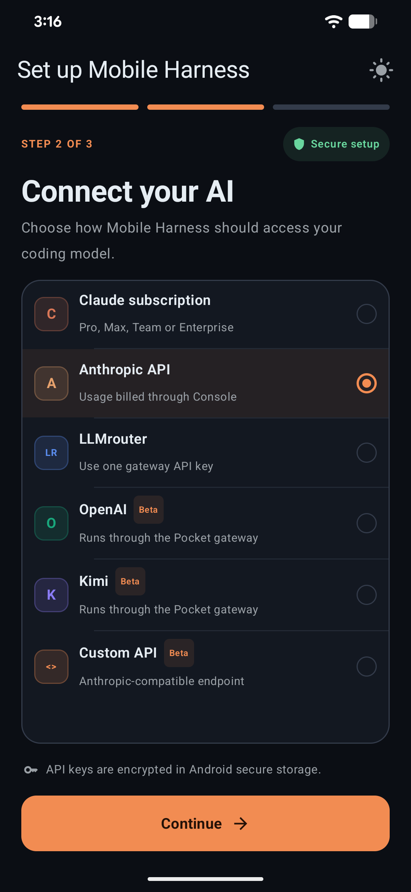
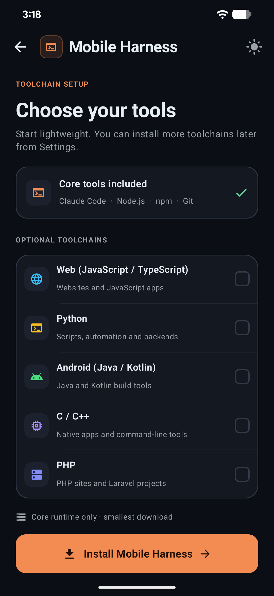
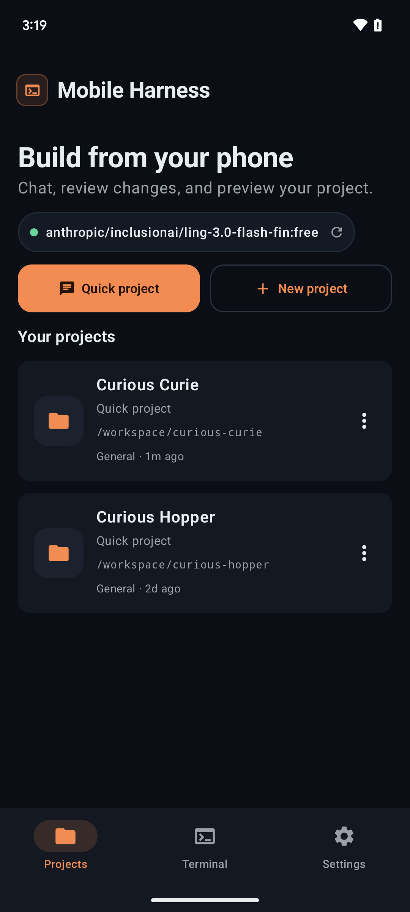
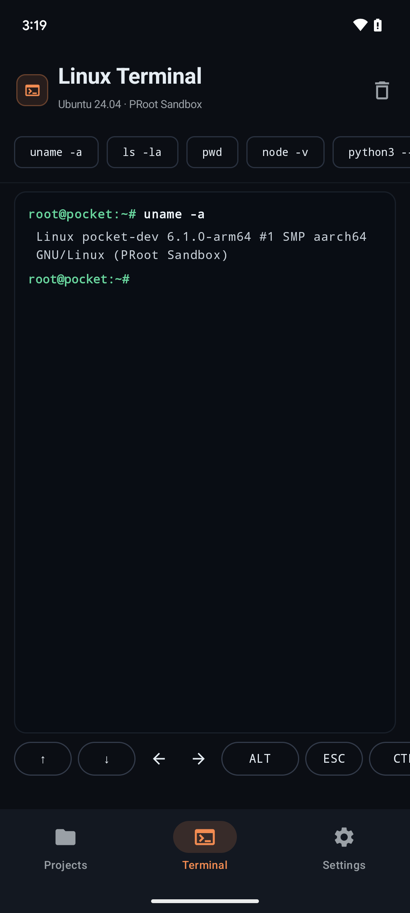
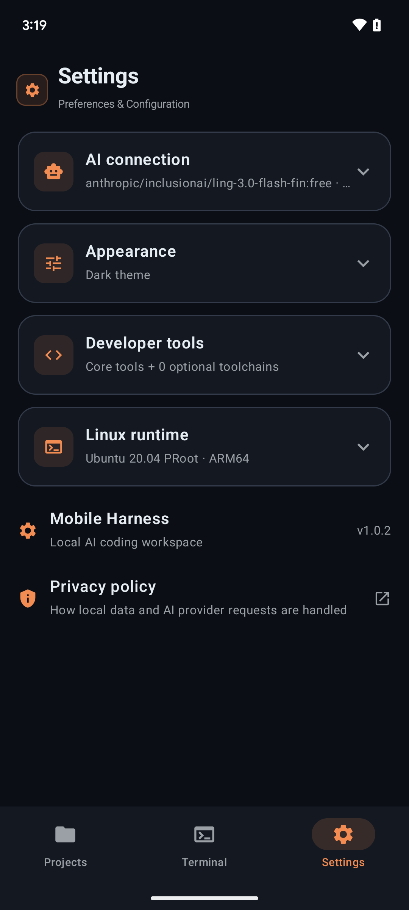
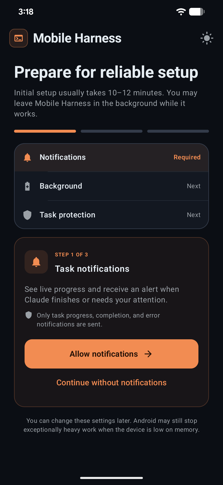

<div align="center">

  

  # ⚡ NovaCode Studio

  ### Professional Mobile Linux IDE & Autonomous AI Coding Environment for Android
  **Turn your Android smartphone into a complete, standalone AI software engineering workstation.**

  <br />

  [](#requirements)
  [](#requirements)
  [](https://github.com/rahilanw4r/novacode-studio/releases/latest)
  [](https://github.com/rahilanw4r/novacode-studio/actions)
  [](https://t.me/RahilAnw4r)
  [](LICENSE)

  <br />

  [**📥 Download Latest APK (v1.0.14)**](https://github.com/rahilanw4r/novacode-studio/releases/latest) • [**💬 Telegram Contact**](https://t.me/RahilAnw4r) • [**⭐ Star on GitHub**](https://github.com/rahilanw4r/novacode-studio) • [**🐛 Report Bug**](https://github.com/rahilanw4r/novacode-studio/issues)

  <br />

  <p align="center">
    <em>Developed & Engineered with passion by <strong><a href="https://github.com/rahilanw4r">Rahil Anwar</a></strong> (Telegram: <a href="https://t.me/RahilAnw4r">@RahilAnw4r</a>)</em>
  </p>

</div>

---

## 📖 Overview

**NovaCode Studio** is an open-source, mobile-first Linux development environment and autonomous AI workspace designed specifically for Android devices. Unlike simple mobile text editors or cloud-streamed containers, NovaCode Studio operates **100% locally on your phone** using an isolated **PRoot Linux userspace (Ubuntu ARM64)**. 

Compile real programs, run live web servers, launch multi-tab terminals, inspect side-by-side Git diffs, and collaborate with advanced coding agents like **Google AntiGravity (Gemini 3.8)**, **Claude Code (3.7 Sonnet)**, and **DeepSeek Coder** — all without root access and without a PC.

---

## ✨ Key Features

<table>
  <tr>
    <td width="50%" valign="top">
      <h3>🤖 Autonomous AI Coding Agents</h3>
      <ul>
        <li><strong>Google AntiGravity</strong>: Native integration with Google DeepMind's CLI agent with seamless browser OAuth login and full Gemini 3.8/3.6/3.1 reasoning models.</li>
        <li><strong>Claude Code</strong>: Anthropic's autonomous software engineering CLI with tool-use, multi-file editing, and streaming reasoning chains.</li>
        <li><strong>DeepSeek Coder & OpenAI</strong>: Support for DeepSeek Coder CLI, GPT-4o, and o3-mini via direct API keys or local OpenRouter routing.</li>
      </ul>
    </td>
    <td width="50%" valign="top">
      <h3>🐧 Isolated Linux Runtime (PRoot)</h3>
      <ul>
        <li>Full <strong>Ubuntu ARM64</strong> userspace running safely inside Android app storage without requiring root.</li>
        <li>Pre-installed with <strong>Node.js LTS</strong>, <strong>npm</strong>, and <strong>Git</strong>.</li>
        <li>On-demand 1-click toolchains for <strong>Python</strong> (pip, venv), <strong>C/C++</strong> (gcc, g++, cmake), <strong>PHP</strong> (Composer), and native <strong>Android Compilation</strong> (SDK 36, Gradle 8.14.3, AAPT2).</li>
      </ul>
    </td>
  </tr>
  <tr>
    <td width="50%" valign="top">
      <h3>🎨 Apple-Inspired Liquid AI Design</h3>
      <ul>
        <li>Modern developer-tool interface built with <strong>Jetpack Compose</strong>.</li>
        <li>Refined <strong>Obsidian Dark</strong> and dynamic <strong>Light Palette</strong> modes with emerald/green accents (#18C78A).</li>
        <li>Subtle glassmorphic cards, crisp typography, 48dp+ touch targets, and fluid gesture navigation.</li>
      </ul>
    </td>
    <td width="50%" valign="top">
      <h3>🔍 Granular Git Diff Inspector</h3>
      <ul>
        <li>Review file changes generated by AI agents before applying them.</li>
        <li>Syntax-highlighted unified and split diff views with individual <strong>Accept</strong> and <strong>Revert</strong> buttons per hunk.</li>
        <li>Integrated GitHub CLI (<code>gh</code>) for signing in, cloning private repositories, and managing pull requests.</li>
      </ul>
    </td>
  </tr>
  <tr>
    <td width="50%" valign="top">
      <h3>⌨️ Floating Developer Key Toolbar</h3>
      <ul>
        <li>Ergonomic row hovering directly above the on-screen keyboard.</li>
        <li>Instant single-tap access to critical developer keys: <code>ESC</code>, <code>TAB</code>, <code>CTRL</code>, <code>ALT</code>, <code>|</code>, <code>~</code>, <code>/</code>, <code>-</code>, <code>_</code>, and arrow navigation.</li>
        <li>Customizable snippet expansion and terminal shortcuts.</li>
      </ul>
    </td>
    <td width="50%" valign="top">
      <h3>🌐 Multi-Device Web DevTools Preview</h3>
      <ul>
        <li>Built-in WebView browser emulator connected to local development servers (Vite, Next.js, FastAPI, Flask, etc.).</li>
        <li>One-tap responsive viewport switching (Mobile 375px, Tablet 768px, Desktop Full).</li>
        <li>Live console log viewer capturing JavaScript logs, warnings, and errors in real time.</li>
      </ul>
    </td>
  </tr>
</table>

---

## 📸 Screenshots & Workflow

<div align="center">
  <table>
    <tr>
      <td align="center" width="33%">
        
        <br /><strong>AI Agent Selection</strong>
      </td>
      <td align="center" width="33%">
        
        <br /><strong>Language Toolchains</strong>
      </td>
      <td align="center" width="33%">
        
        <br /><strong>Projects & Templates</strong>
      </td>
    </tr>
    <tr>
      <td align="center" width="33%">
        
        <br /><strong>Multi-Tab Terminal</strong>
      </td>
      <td align="center" width="33%">
        
        <br /><strong>Theme & Developer Settings</strong>
      </td>
      <td align="center" width="33%">
        
        <br /><strong>Background Tasks & Service</strong>
      </td>
    </tr>
  </table>
</div>

---

## 🗂️ Navigation Hierarchy

NovaCode Studio organizes the development workflow into 5 streamlined destinations:

```
┌─────────────────────────────────────────────────────────────────┐
│                          NovaCode Studio                        │
├───────────┬──────────────┬─────────────┬─────────────┬──────────┤
│   Home    │   Projects   │   Copilot   │  Terminal   │   More   │
└───────────┴──────────────┴─────────────┴─────────────┴──────────┘
```

1. **Home**: Fast actions, active sandbox status, recent project shortcuts, and one-tap starter templates (React + Vite, FastAPI, Node.js, Python, Android).
2. **Projects**: Comprehensive file tree, code editor with syntax highlighting, live preview panel, and hunk-by-hunk Git diff inspector.
3. **Copilot**: Interactive AI pair programming chat, quick command chips (*Fix Code*, *Explain*, *Build*, *Refactor*), model selector, and execution logs.
4. **Terminal**: Hardware-accelerated multi-session terminal emulator with ANSI color support, custom shell profiles, and dev toolbar.
5. **More**: Extended tools and utilities:
   - ⚙️ **Settings**: Appearance (Dark/Light), editor fonts, tab spacing, and keybindings.
   - 🛠️ **Developer Tools**: Memory stats, PRoot virtualization inspection, and debug bridges.
   - 🐧 **Linux Runtime**: Manage installed stacks, purge caches, or repair packages.
   - 🔄 **Update Channel**: One-tap in-app updates for AI agent binaries and studio releases.
   - 🐙 **Git & GitHub**: Authentication status, SSH keys, and remote repository manager.
   - 👤 **About Creator**: Developer profile, Telegram contact, and release details.

---

## 🧰 Supported Languages & Toolchains

| Stack | Included Tools | Supported Project Types |
| :--- | :--- | :--- |
| **Core (Always On)** | Node.js LTS, npm, Git, bash, coreutils | JavaScript, TypeScript, Shell scripts, Git repos |
| **Python** | Python 3, pip, venv, build tools | FastAPI, Flask, Django, automation, data science |
| **Web Dev** | Node.js, Vite, npm, npx | React, Vue, Svelte, Next.js, HTML/CSS/JS |
| **Android** | OpenJDK 17, Android SDK 36, AAPT2, Gradle 8.14.3, Offline Maven | Native Android Java & Kotlin applications |
| **C / C++** | gcc, g++, make, cmake, gdb | C/C++ compiled binaries, algorithms, systems |
| **PHP** | php-cli, common extensions, Composer | Classic PHP sites, Laravel, Composer packages |

---

## 📱 Hardware & Software Requirements

- **Operating System**: Android 9.0 (API Level 28) or higher
- **Architecture**: **ARM64** (`aarch64` / `arm64-v8a`)
- **Memory**: 3 GB RAM or more recommended
- **Storage Space**:
  - ~300 MB for Base Core Runtime (Node.js + Git + Linux base)
  - ~1.5 GB recommended if enabling Python, C/C++, and Android toolchains
- **Root Permissions**: **Zero Root Required** (runs safely in user space)

---

## 🚀 Installation & Getting Started

### Method 1: Download Prebuilt APK (Recommended)
1. Download the latest APK from the **[GitHub Releases Page](https://github.com/rahilanw4r/novacode-studio/releases/latest)** (`NovaCode-Studio-v1.0.14.apk`).
2. Open the downloaded file on your Android device and confirm installation.
3. Grant notification permissions when prompted to allow background build monitoring.
4. Complete the 3-step onboarding setup to install the Linux environment and pick your preferred AI agent.

### Method 2: Build From Source

```bash
# 1. Clone the repository
git clone https://github.com/rahilanw4r/novacode-studio.git
cd novacode-studio

# 2. Compile native PRoot bindings and Android APK
./gradlew :app:assembleOnlineDebug

# 3. Locate output APK
ls -lh app/build/outputs/apk/online/debug/NovaCode-Studio-*.apk
```

---

## 🔒 Privacy & Security First

- **Direct AI Provider Communication**: All requests to AI models (Gemini, Claude, DeepSeek, OpenAI) communicate directly between your device and the provider's API. No intermediate proxies or third-party servers see your code.
- **Hardware-Backed Encryption**: Sensitive credentials such as GitHub tokens and AI API keys are stored securely using Android's `EncryptedSharedPreferences` backed by the **Android Keystore (AES-256-GCM)**.
- **Isolated Sandbox**: The Linux environment runs within private application storage (`/data/data/com.novacode.studio/files/`), strictly isolated from other apps on your device.

---

## 👨‍💻 Author & Contact

**NovaCode Studio** is designed, developed, and maintained by:

<div align="left">
  <table>
    <tr>
      <td><strong>Creator</strong></td>
      <td><strong>Rahil Anwar</strong></td>
    </tr>
    <tr>
      <td><strong>GitHub</strong></td>
      <td><a href="https://github.com/rahilanw4r">@rahilanw4r</a></td>
    </tr>
    <tr>
      <td><strong>Telegram</strong></td>
      <td><a href="https://t.me/RahilAnw4r">@RahilAnw4r</a></td>
    </tr>
    <tr>
      <td><strong>Repository</strong></td>
      <td><a href="https://github.com/rahilanw4r/novacode-studio">rahilanw4r/novacode-studio</a></td>
    </tr>
  </table>
</div>

> *"Bringing desktop-grade engineering tools to the device you carry everywhere."*

---

## 📄 License

This project is licensed under the **Apache License 2.0**. See the [LICENSE](LICENSE) file for details.
