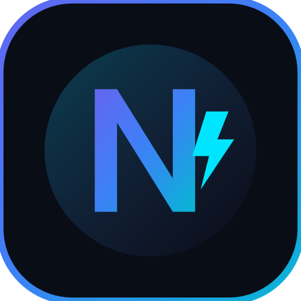

<div align="center">

  

  <h1>⚡ NovaCode Studio</h1>
  <h3>The Next-Generation Autonomous AI Mobile IDE for Android</h3>
  <p><em>Engineered by Rahil Anwar (<a href="https://github.com/rahilanw4r">@rahilanw4r</a>)</em></p>

  <br />

  [](#requirements)
  [](#requirements)
  [](#automated-builds)
  [](LICENSE)

  <br /><br />

  <strong>Turn your Android smartphone into a complete, standalone AI engineering workstation.</strong><br />
  Execute real Linux commands, collaborate with autonomous AI agents, inspect live Git diffs, and preview web apps locally — with zero root and zero PC tethering required.

  <br /><br />

  <a href="https://github.com/rahilanw4r/novacode-studio/releases/download/v1.0.0/NovaCode-Studio-v1.0.0-debug.apk">
    
  </a>

</div>

<br />

---

## 🌟 What makes NovaCode Studio Unique?

NovaCode Studio is completely redesigned from the ground up to bring desktop-class software development directly to mobile touchscreens:

<table>
  <tr>
    <td width="50%" valign="top">
      <h3>⚡ Unified HUD & Studio Navigation</h3>
      <p>Seamlessly switch between <strong>Agent Chat</strong>, <strong>Code Studio</strong>, <strong>Web Preview</strong>, and <strong>Multi-Tab Terminal</strong> without losing your state or execution context.</p>
    </td>
    <td width="50%" valign="top">
      <h3>🧠 Multi-Provider AI Engine</h3>
      <p>Connect to <strong>Google Gemini 2.5 (Pro & Flash)</strong>, <strong>OpenAI (GPT-4o & o3-mini)</strong>, <strong>Anthropic Claude 3.7</strong>, and local <strong>Ollama / LM Studio</strong> models with streaming reasoning chains.</p>
    </td>
  </tr>
  <tr>
    <td width="50%" valign="top">
      <h3>⌨️ Virtual Developer Key Toolbar</h3>
      <p>Quick-access bar floating right above the software keyboard providing one-tap access to <code>ESC</code>, <code>TAB</code>, <code>CTRL</code>, <code>ALT</code>, <code>|</code>, <code>~</code>, arrows, and code snippet expansion.</p>
    </td>
    <td width="50%" valign="top">
      <h3>🔍 Live Hunk-by-Hunk Git Inspector</h3>
      <p>Inspect AI-generated file modifications with full syntax highlighting. Review individual diff hunks with granular <strong>Accept</strong> and <strong>Revert</strong> controls before committing.</p>
    </td>
  </tr>
  <tr>
    <td width="50%" valign="top">
      <h3>🌐 Responsive Web DevTools Preview</h3>
      <p>Live reload server preview with instant viewport switching (Mobile 375px, Tablet 768px, Desktop Full) and an embedded real-time JavaScript console log monitor.</p>
    </td>
    <td width="50%" valign="top">
      <h3>🐧 Isolated Linux Subsystem (PRoot)</h3>
      <p>Runs a full Ubuntu userspace on ARM64 Android without root. Complete with <code>node</code>, <code>npm</code>, <code>python3</code>, <code>git</code>, and native compilers right in your pocket.</p>
    </td>
  </tr>
</table>

<br />

## 🚀 Key Modules & Architecture

```
┌────────────────────────────────────────────────────────┐
│               NovaCode Studio Core (Compose)          │
├──────────────┬──────────────┬────────────┬─────────────┤
│  Agent HUD   │  Code Studio │  Web View  │  Terminal   │
│  Streaming   │  File Tree   │  DevTools  │  Multi-Tab  │
│  Reasoning   │  Diff Viewer │  Logger    │  ANSI / PTY │
├──────────────┴──────────────┴────────────┴─────────────┤
│            Virtual Dev Toolbar (ESC, TAB, CTRL)        │
├────────────────────────────────────────────────────────┤
│             Native JNI Bridge (pocket_spawn)           │
├────────────────────────────────────────────────────────┤
│           PRoot Linux Subsystem (Ubuntu ARM64)         │
└────────────────────────────────────────────────────────┘
```

- **`NovaMasterWorkspace.kt`**: High-performance coordinator screen handling smooth transitions between work modes.
- **`NovaCodeStudioScreen.kt`**: Hierarchical project file explorer and side-by-side patch reviewer.
- **`NovaWebPreviewScreen.kt`**: Multi-resolution viewport emulator with JavaScript message bridge.
- **`NovaTerminalScreen.kt`**: Multi-session terminal emulator with quick bash execution and persistent history.
- **`NovaComponents.kt`**: Cyber-minimalist design system featuring OLED dark surfaces, neon cyan accents, and collapsible thinking chains.

<br />

## 📱 Requirements

- **Device**: Android 9.0 (API 28) or higher
- **Architecture**: ARM64 (aarch64 / arm64-v8a)
- **Storage**: At least 1.5 GB free storage recommended for runtime environment and toolchains
- **Root Access**: **NOT REQUIRED** (runs completely in user space via PRoot)

<br />

## 🛠️ Automated Cloud Builds

Every push to this repository automatically triggers a GitHub Actions pipeline that compiles the native C/C++ libraries and Android APK:

1. Go to the **[Actions Tab](https://github.com/rahilanw4r/novacode-studio/actions)** in this repository.
2. Select the latest build run.
3. Scroll down to **Artifacts** to download `NovaCode-Studio-Debug-APK`.
4. Install the `.apk` directly onto your Android device!

<br />

## 💻 Building from Source Locally

To build the APK locally using the Android SDK and NDK:

```bash
# Clone the repository
git clone https://github.com/rahilanw4r/novacode-studio.git
cd novacode-studio

# Build debug APK
./gradlew :app:assembleOnlineDebug

# Locate generated APK
ls -lh app/build/outputs/apk/online/debug/app-online-debug.apk
```

<br />

## 🛡️ Privacy & Security

- **Direct Connections**: Your AI API keys and prompts are sent directly from your phone to your selected AI provider (Google, Anthropic, OpenAI, or local server). There are no intermediary cloud proxy servers or tracking telemetry.
- **Hardware Encryption**: API keys are saved locally inside Android Keystore using AES-256-GCM encryption.

<br />

## 👤 Author & Credits

- **Developer & Maintainer**: [Rahil Anwar](https://github.com/rahilanw4r)
- **Project**: NovaCode Studio
- **License**: Apache License 2.0 (see [LICENSE](LICENSE))
